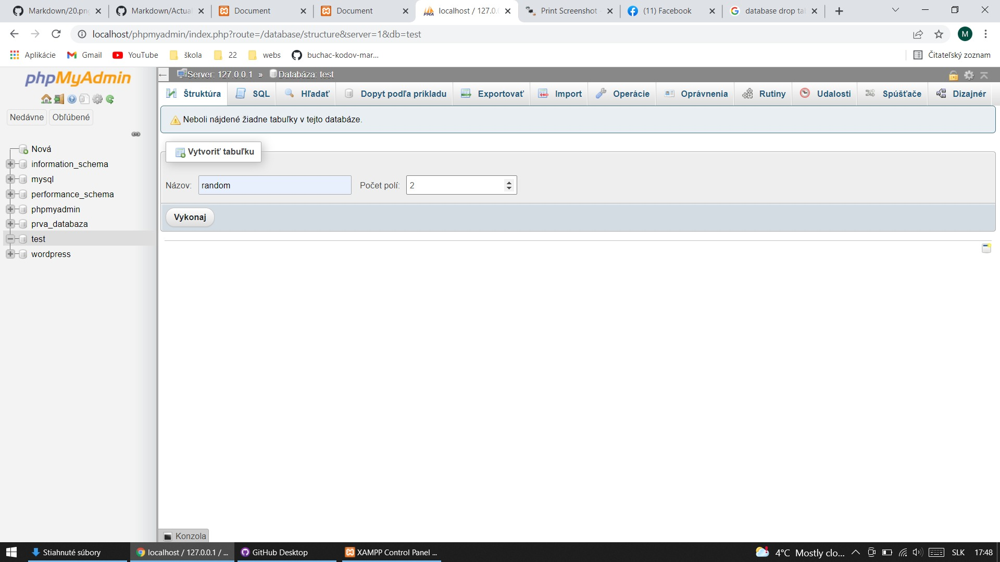
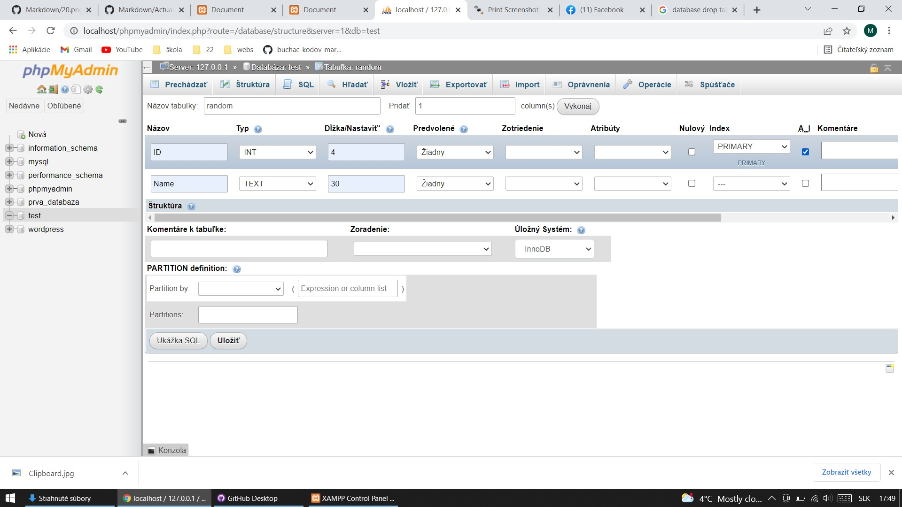
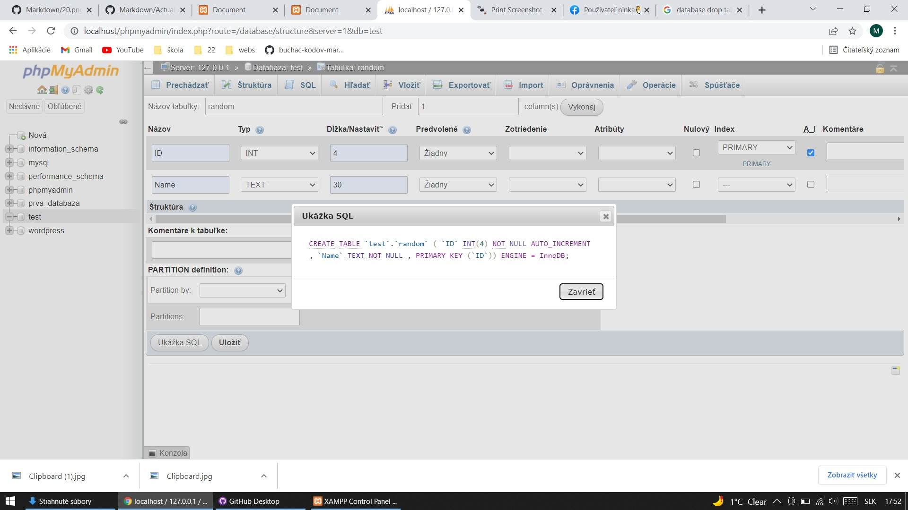
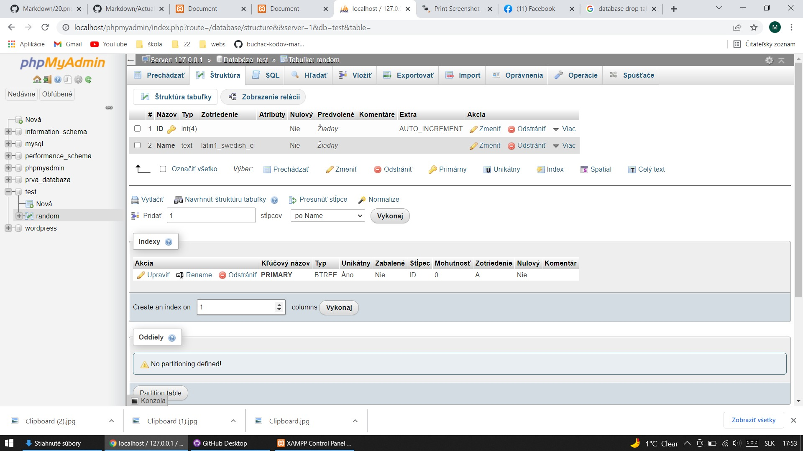
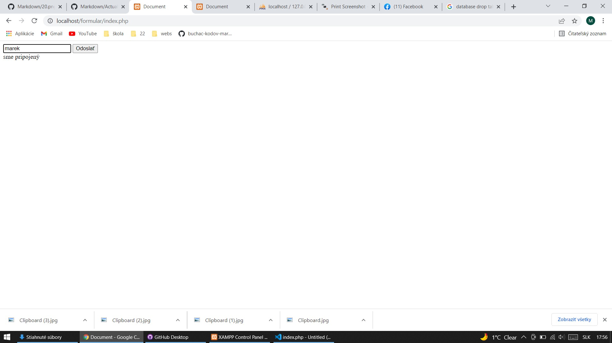
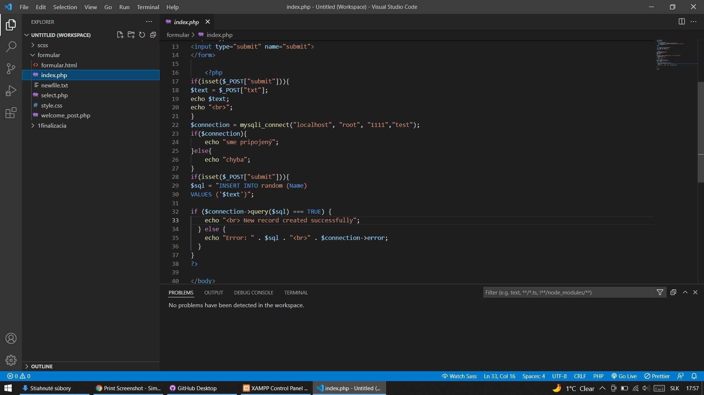
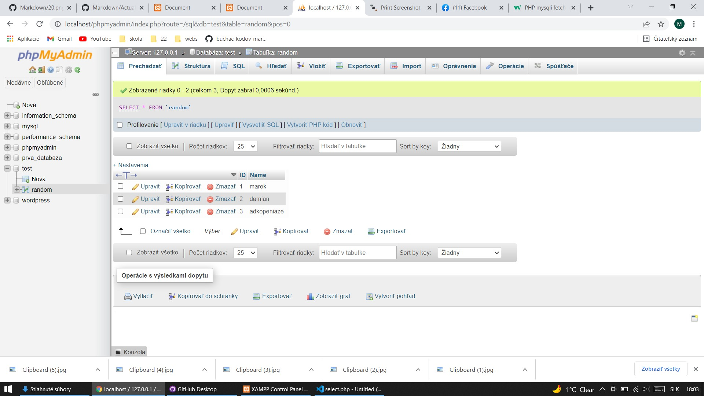
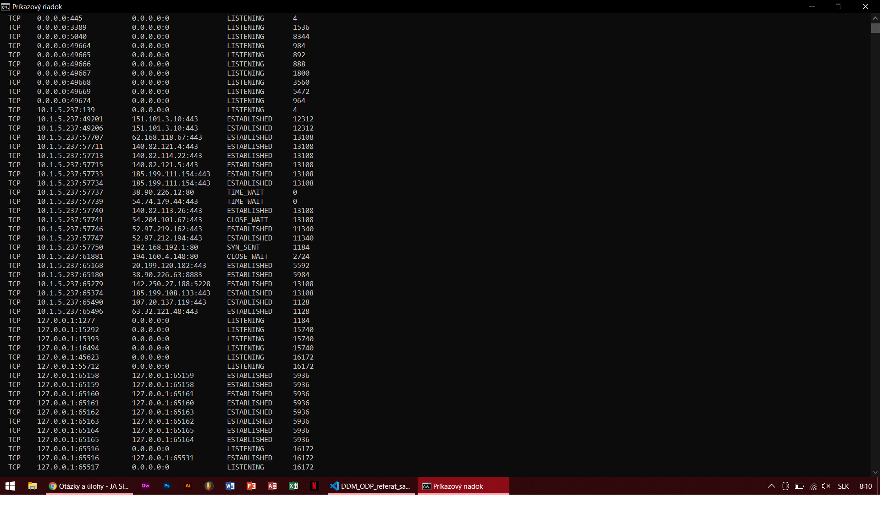
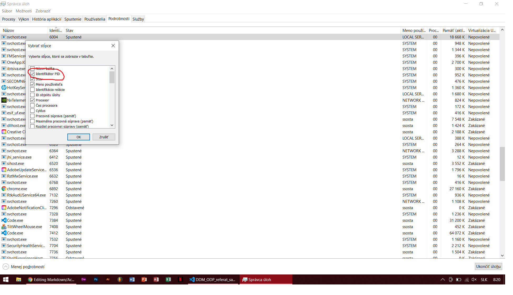
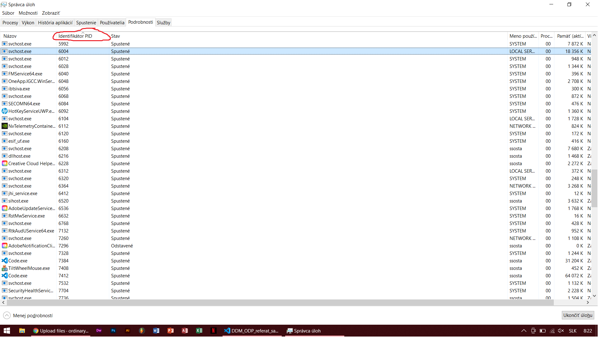

<!-- V markdowne je možné použiť aj CSS -->

# Nastavenie XAMPP

Damián Nadžady Marek Šafařík Adrian Fáber

# Obsah
[Nastavenie XAMPP](#nastavenie-xampp)
- [Nastavenie XAMPP](#nastavenie-xampp)
- [Obsah](#obsah)
  - [Nastavenie pre executable programy v CMD](#nastavenie-pre-executable-programy-v-cmd)
  - [Zapnutie PHP v CMD](#zapnutie-php-v-cmd)
  - [Pripojenie do databazy a orientovanie v nej](#pripojenie-do-databazy-a-orientovanie-v-nej)
- [PID porty](#pid-porty)
  - [Príkaz Netstat](#príkaz-netstat)
<!-- Obsah vygenerovať neskor
ak mas extension tak CTRL+SHIFT+P a napisat create table of content
-->

## Nastavenie pre executable programy v CMD

Naprv si musíme skontrolovať ktoré cesty majú v sebe executable property pre zapnutie programov, ak v tomto výpise nemáme cestu k programu ktorý chceme spustit cez konzolu tak ho nebudeme mocť spustiť.

Do `CMD` napísemme príkaz `echo %PATH%` aby sme zistili aké cesty máme povolené.

Ak chceme pridať executable cesty naprv potrebujeme zistiť kde sa nachádza `.exe` program ktorý hladáme

Pre pridanie cesty stlacime `Windows + R` a zadáme daný príkaz. Následne pokračujeme podľa šipiek v obrázkoch.

Klikneme na Path a upraviť a pridáme novú cestu, zvýraznené cesty sú cesty k mysql a php

## Zapnutie PHP v CMD

Vďaka pridaniu cesty k programu `php.exe` vieme v CMD execuovať php súbory alebo zapnúť samotné PHP

Prvým príkazom sme inicializovali PHP a druhým sme spustili daný súbor pomocou prikazu PHP v danej ceste

## Pripojenie do databazy a orientovanie v nej

Ujistime sa že máme zapnutý MySQL a Apache server

Pripojíme sa na databázu ako `root` používateľ

príkaz: `mysql -uroot -p`

pre `root` používateľa vieme zistiť heslo a IP adresu na ktorú by sa mal pripojiť v phpMyAdmin configu

Databázu už máme vytvorenú tak si do nej vytvoríme tabuľku ktorá bude obsahovat 2 polia.

Prvé pole bude `ID` ktoré je základom takmer každej databázy. Nastavíme si typ integer lebo `ID` sa udáva v číslach dlžku si nastavíme na 4 cifry to by malo zďaleka stačiť a ešte si nastavíme `auto increment` aby sa nám ID číslo samo zväčšovalo. Ďalší riadok si spravíme poľe `Name` ktoré bude mať kapacitu 30 znakov a ako typ si dáme samozrejme text.

Tu si môžme pozrieť SQL kód ktorý sa nám vygeneroval a môžme si ho skontrolovať. Potom už len stlačíme `Uložiť` a vytvorí sa nám tabuľka.

Prehľad štruktúry našej tabuľky.

Pomocou formulára odošleme do databázy meno, ktoré sa nám uloží a pridelí sa mu ID.

Tu môžeme vidieť kód zápisu dát do tabuľky kde je na začiatku úpnom začiatku jednoduchý html formulár a potom prepojenie s
databázou. V spodnej časti je odoslanie a zápis dát do databázi.

Tu môžeme vidieť ako sa nám spokojne zapísali naše mená do tabuľky.

# PID porty

## Príkaz Netstat

Ak chcete začať, otvorte príkazový riadok kliknutím na tlačidlo `Štart` a zadaním príkazu `cmd` . V príkazovom okne pokračujte a napíšte nasledujúci príkaz:
<pre class="hljs"><code>
netstat -a -n -o

</code></pre>

V príkaze vyššie je parametrom -o to, čo pridá PID na koniec tabuľky. Stlačte kláves Enter a mali by ste vidieť niečo takéto:

Môžete vidieť port, ktorý sa používa v druhom stĺpci Local Address. Po dvojbodke sa zobrazí číslo portu. Uvidíte aj niektoré porty a niektoré PID uvedené viac ako raz. Je to preto, lebo jeden proces môže používať rovnaké číslo portu na rôznych protokoloch, ako je TCP, UDP atď.

Teraz vidíte názov procesu, ktorý používa daný port, prejdite do Správcu úloh stlačením klávesov `CTRL + SHIFT + ESC` a potom kliknite na kartu <b>Proces</b> . V systéme Windows 10 by ste mali kliknúť na kartu <b>Podrobnosti</b> .

V predvolenom nastavení správca úloh nezobrazuje ID procesu, takže musíte kliknúť na položku <b>Zoraziť</b> a potom <b>Vybraťt stĺpce</b> . V systéme Windows 10 je ID procesu už uvedené, takže môžete preskočiť nižšie uvedené kroky.

Pokračujte a začiarknite políčko <b>PID (Identifikátor procesu)</b> a potom kliknite na tlačidlo <b>OK</b>.

Teraz by ste mali vidieť aj PID vedľa názvu procesu v správcovi úloh. Môžete kliknúť na záhlavie stĺpca a rýchlo zoradiť zoznam podľa PID, čo vám pomôže nájsť proces, ktorý hľadáte.

<!-- TOD-
<!-- Pridat aj veci dajake zo zaciatku roka co sme robili a aj dorobit fotky do pondelka (PID porty atd)
Potom este pridat dajaky problem co sme mali -->
