<style>


h1 { counter-reset: h2counter; }
h2 { counter-reset: h3counter; }
h3 { counter-reset: h4counter; }
h4 { counter-reset: h5counter; }
h5 { counter-reset: h6counter; }
h6 {}

h2:before {
    counter-increment: h2counter;
    content: counter(h2counter) ".\0000a0\0000a0";
}

h3:before {
    counter-increment: h3counter;
    content: counter(h2counter) "." counter(h3counter) ".\0000a0\0000a0";
}

h4:before {
    counter-increment: h4counter;
    content: counter(h2counter) "." counter(h3counter) "." counter(h4counter) ".\0000a0\0000a0";
}

h5:before {
    counter-increment: h5counter;
    content: counter(h2counter) "." counter(h3counter) "." counter(h4counter) "." counter(h5counter) ".\0000a0\0000a0";
}

h6:before {
    counter-increment: h6counter;
    content: counter(h2counter) "." counter(h3counter) "." counter(h4counter) "." counter(h5counter) "." counter(h6counter) ".\0000a0\0000a0";
}
img[src*='#left'] {
    float: left;
}
img[src*='#right'] {
    float: right;
}
img[src*='#center'] {
    display: block;
    margin: auto;
}
</style>
#Obsah
- [Nastavenia sietových kariet vo Virtual Box](#nastavenia-sietových-kariet-vo-virtual-box)
  - [Čo je Virtual Box a čo su jeho nastavenia](#čo-je-virtual-box-a-čo-su-jeho-nastavenia)
    - [VB - Virtual box ma mnoho nastavený](#vb---virtual-box-ma-mnoho-nastavený)
    - [Sieťové nastavenia vo Virtual Boxe](#sieťové-nastavenia-vo-virtual-boxe)
    - [Typ adaptéra](#typ-adaptéra)
      - [NAT <b>Default</b>](#nat-bdefaultb)
      - [Bridged adapter](#bridged-adapter)
      - [Internal Network](#internal-network)
      - [Host-only adapter](#host-only-adapter)
      - [Generic driver](#generic-driver)
      - [NAT Network](#nat-network)
      - [Cloud Network](#cloud-network)
      - [Bez adaptéra](#bez-adaptéra)
  - [Zapojenie a komunikacia pri Bridge adaptéry](#zapojenie-a-komunikacia-pri-bridge-adaptéry)
    - [Nastavenie](#nastavenie)
    - [V Guest OS](#v-guest-os)
  - [Pripojenie cez NAT](#pripojenie-cez-nat)
    - [Nastavenie NAT](#nastavenie-nat)
    - [Nastavenie Port-Forwardingu](#nastavenie-port-forwardingu)
  - [Placeholder dalsej praktickej casti](#placeholder-dalsej-praktickej-casti)
  - [Trobleshooting](#trobleshooting)
  - [Zdroje](#zdroje)

# Nastavenia sietových kariet vo Virtual Box

<center>Tento referát sa zaoberá sieťovými nastaveniami v programe Virtual Box</center>
TODO: pripisať mena kto to este (ne)robil
<center>Vypracoval: Damián Nadžady 3.A 13.5.2022, Adrián Fáber 3.A 5.6.2022, Marek Šafařík 3.A 5.6.2022</center>

TODO: vytvoiť obsah, tutorial je na spodku

## Čo je Virtual Box a čo su jeho nastavenia

Virtual Box (type-2 hypervisor) je program v ktorom používateľ môže simulovať virtulany počítač ktorý bezi v takzvanom sandboxe a je oddelený od hlavného počitača ktorý beží priamo na komponentoch. Virtual Box beží ako program to znamená že o požiadavky na prístup k komponentom (CPU, RAM, ...) prechádzaju cez OS ktorý beží na komponentoch.

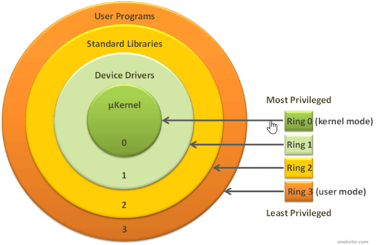

### VB - Virtual box ma mnoho nastavený

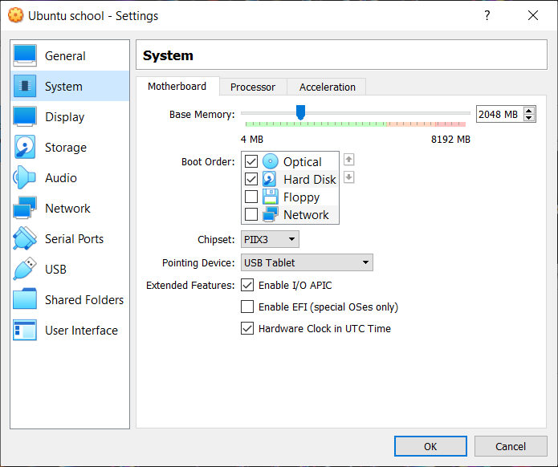

Jedno z podstatných nastavený je nastavenie sietovej karty v danom virtualnom PC
### Sieťové nastavenia vo Virtual Boxe
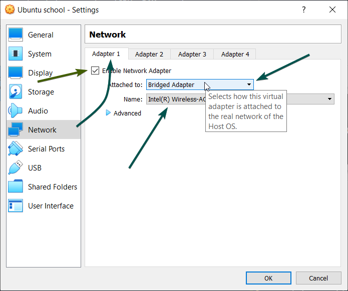

V záložke Network máme niekoľko adaptérov ktoré si vieme zapnút, to môžeme chápať ako 4 rozdielne sietové kartky na ktoré si vieme nastaviť iné módy ktoré sú priradené k fyzickým komponentom.

V ďalšej ponuke si vieme vybrať cez ktorý fyzicky interface chceme tento PC nechať komunikovať.

V ponuke Advanced si môžeme nastaviť port-forwarding alebo virtualnu MAC adresu daného adaptéra, plus niekoľko dalších nastavený.  

### Typ adaptéra

Po rozklinutý položky Advanced si môžeme vybrat aj adaptér ktorý sa bude zobrazovať v samotnom guest OS

<ul style="list-style-type:circle;">
  <li>AMD PCNet PCI II (Am79C970A)</li>
  <li>AMD PCNet FAST III (Am79C973)</li>
  <li>Intel PRO/1000 MT Desktop (82540EM), <b>Default</b></li>
  <li>Intel PRO/1000 T Server (82543GC)</li>
  <li>Intel PRO/1000 MT Server (82545EM)</li>
  <li>Paravirtualized network adapter (virtio-net)</li>
</ul>


#### NAT <b>Default</b>
NAT - Network address translation

Najjednoduchší sposob ako sa cez guest PC pripojiť na internet a surfovať externé stránky. Nevyžaduje si žiadne nastavenia a funguje takzvane out of the box. Je zvolený ako prevolený režim virtualnej sietovej karty.

Guest OS sa chová ako keby to bol PC za routerom na privatnej siety, tento router je v realite __Oracle VM VirtualBox NAT Engine__ ktorý dostane packety z Guesta a znova ich zabali a posle na router z OS vo fyzickom PC.

Nevýhodou je že takýto Guest OS nie je vidieť separatne na internete a ak sa k nemu chceme pripojit musíme nastavit portforwarding.

Guest OS dostane DHCP server a iné podstatné adresy z _Oracle VM VirtualBox NAT Engine_ ktorý sa chová ako router na klasickej siety. IP adresa sa prideluje z inej siete ako ta na ktorej je fyzický PC. Adresa začína 10.0.2.0 pre prvý interface, 10.0.3.0 predruhy int a tak dalej.


___

#### Bridged adapter

Používaťel si vie zvoliť cez ktorý fyzický adaptér sa bude trafica na siety posielať

Oracle VM VirtualBox využíva _net filter driver_ na to aby oddelil dáta ktoré sú smerované pre Guest OS. To znamená že na siety sa vytvorý virtualne rozhranie ktoré funguje ako další PC na siety, Guest OS dostane od DHCP všetko potrebné pre komunikáciu s routerom. Guest OS vkladá data fyzickému rozhraniu ktoré ho zabalí za svoje. To znamená že komunikácia na súkromnej siety medzi virtualnym OS a ostatnými PC s IP adresamy je možné.


___

#### Internal Network

Funguje podobne ako Bridge adapter s rozdielom tým že tento privatna sieť slúži iba pre Guest OS na jednom fyzickom PC.
Táto sieť je použitá ak chcem mať viac virtuálnych PC na jednom fyzickom PC a chceme aby spolu komunikovali ale aby sa táto komunikacia nedostala k iným hostom na privatnej sieti fyzického PC.
Pri Bridge adaptéry idú všetky packety cez fyzické rozhranie rozhranie host OS a preto sa dajú zaznamenať napr. cez Wireshark, takto tomu vie me zabrániť. 
Pei vytváraný si vyberáme meno vďaka ktorému sa sieť identifikuje.
Po čo __Oracle VM VirtualBox support driver__ detekuje další Guest OS s rovnakým network ID tak ich automatický pripojí a začne sa chovať ako _Switch_.
Pre pripojenie na sieť možeme buď zvolit vstavaný DHCP server ale priradiť statické IP adresy.


___

#### Host-only adapter

Funguje ako zmiešanie Bridge a internal adaptérov.
__Oracle VM VirtualBox__ vytvorý nový softwareový loopback interface hneď veďla fyzického interfacu.
Pre jeden Guest OS možeme nastaviť Internal network aby vedel komunikovať iba vrámci host OS s iným Guest OS.
Na druhom Guest OS nastavýme Host-Only, to znamená že druhý Guest OS vie komunikovať aj na internal network s prvým Guest OS ale zároveň ma aj IP adresu ako Bridge na privatnej sieti host OS.


___

#### Generic driver

Tento network mode umožnuje zdieľať generické sieťové interfaci. Používaťel sy može vybrat ktorý potrebuje, nachádzajú sa v extension packoch alebo sa musia kompilovať zo zdroja.

Poznáme __UDP tunneling__: Prepojuje Guest OS jedneho host OS na iných host OS PC, funguje tak že zaobaľuje prijaté a odoslané Ethernetové framey guest sieťovou kartov do _UDP/IP datagrams_.

__Virtual Distributed Ethernet (VDE) Networking__: Guest OS sa vedia pripojiť na _Virtual Distributed Switch (VDS)_ na _Linux_ alebo _FreeBDS_ host OS, Pre použitie je potrebné skompilovať VirtialBox zo zdroja.

#### NAT Network

TODO: dorobiť este tento adapter

#### Cloud Network

Najnovšie nastavenie, je v štádiu vývoja Oracle ho označuje za __Experimentálne__. 

#### Bez adaptéra

Toto nastavenie znamená že Guest OS nedokaže komunikovať vôbec, jeho sieťová karta neexistuje/nie je pripojená a preto jeho pristup na akukoľvek sieť a jeho komunikacia je úplne znemožnená.
___

__Sumarizácia__


---

## Zapojenie a komunikacia pri Bridge adaptéry
### Nastavenie

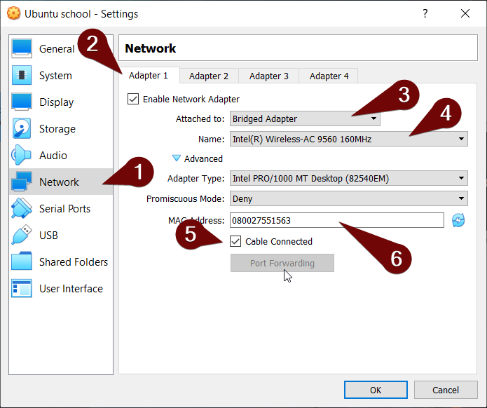
Pre vyskúśanie Bridge adaptéra budeme potrebovať uz existujúci Guest OS alebo si ho vytvoríme.
Pripojenie na nejakú sieť (postačí aj pripojenie na domácu privátnu sieť ktorá môže mať prístup aj na internet).
Po vytvorený si klikneme na tlačidlo Settings.
1. Po otvorený nastavený sa navigujeme do záložky Network
2. Tam si klikneme na akýkoľvek adaptér (perferovaný je 1 aby sme pochopili nastavenia) a zaškrtneme _Enable Network Adapter_ 
3. Z ponuky pri Attached to zvolíme _Bridget Adapetr_
4. V kolonke Name zvolíme cez aký fyzický adaptér budememe komunikovať so sieťou (v našom prípade to bude Wi-Fi karta)
5. Zašktneme _Cable Connected_ aby sme pripojili virtualny adaptér
6. V prípade potreby zmeníme MAC acresu virtualneho adaptéra

Potom už len všetko potvrdíme a bootujeme do Guest OS
### V Guest OS
Po na GRUBe a nabootovaný sa prihlásime

Potom čo sme sa dostali na tty session použijeme príkaz 
```Bash
ip a
```
s výstupom: 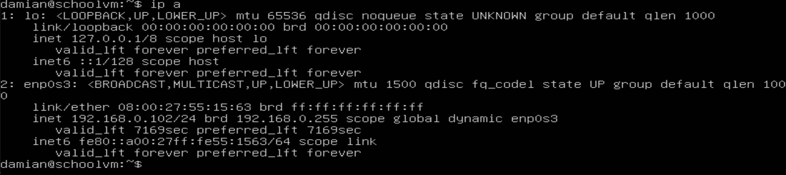

alebo:
```Bash
ifconfig
```
s výstupom: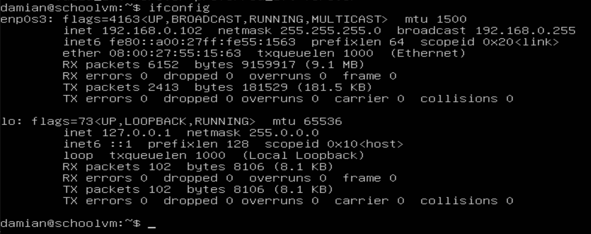

vďaka týmto príkazom si vieme zistiť IP adresu našho Guest OS, pre otestovanie toho ci sa tento Guest OS vieme pripojiť z host OS zistíme či SSH klient je na tomto Guest OS zapnutý príkazom:
```Bash
sudo systemctl status sshd
```
výstup: 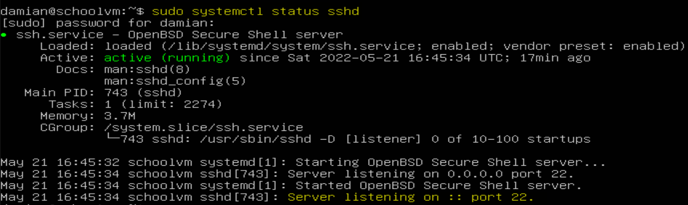
Z tohoto obrázku vieme usúdiť že SSH deamon je na našom Guest OS aktívny a že server počúva pre túto službu na štandardnom porte __22__.

Teraz sa mlžeme skúsiť pripojiť na tento port z nášho host OS cez SSH. Je niekoľko spôsobou ako to urobiť, jedným z nich je program PuTTY ale klasický príkazový riadok.

Klavesovou skratkov __WIN+R__ si otvoríme Run command Windowse a napíšeme doň `cmd` a stlačíme enter, to by nám malo otvoriť príkazový riadok 
Do príkazového riadka napíšeme príkaz:
```CMD
ssh pouzivatel@IP adresa Guesta
ssh damian@192.168.0.102
```
výstup: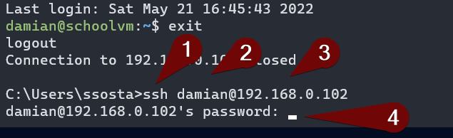
1. Príkaz ktorý chcem vykonať
1. používateľ cez ktorého sa chcem prihlásiť
1. IP adresa host OS
1. zadám heslo daného používateľa pre prihlásenie

Občas sa nás systém može spýtať či sme si naozaj istý, vtedy stači napisať yes a pokračovať
Potom čo sme sa pripojili sa možme presvedčit ze sme naozaj pripojený na spravny počitač príkazmi:
```Bash
sudo systemctl status sshd
```
```Bash
neofetch
```
___
## Pripojenie cez NAT
Ako už bolo spomenuté vyššie tak pripojenie cez NAT je pripojenie na host OS do inej siete, preto budume musieť použit port-forwarding, to sa nastavuje na Routery v konvenčnej siete ale kedže my máme virtualizovanú celu sieť tak to budeme musieť nastaviť v prostedý VirtualBoxu.
### Nastavenie NAT
Budeme postupovať podobne ako pri Bridge adaptéry
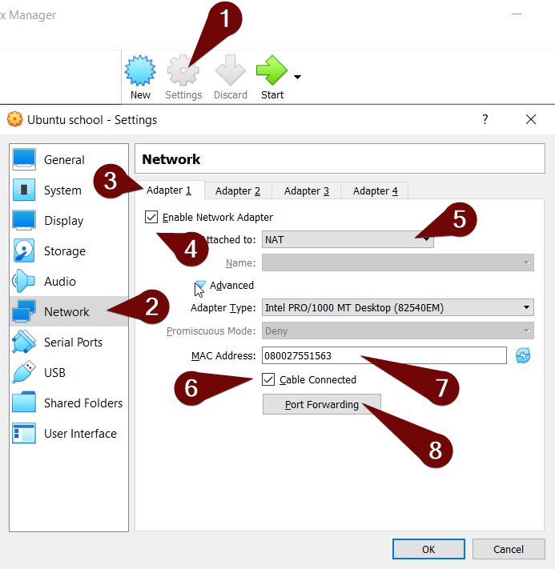

1. Prejdeme na náš nastavený Virtuálny OS a prejdeme do Settings
1. Presunieme sa do záložky Newtwork
1. Zvolíme si niektorý z adaptérov
1. Uistime sa že je daný adaptér zapnutý
2. V sekcii Attached to zvolíme NAT 
3. Uistíme sa že kábel virtualne zapojený
4. Zmeníme MAC adresu ak je to potrebné
5. Povšimneme si tlačidla Port-Forwarding

Potom čo sme uspešne nastavili sieťové nastavenia potvrdíme ich a nabootujeme do host OS
### Nastavenie Port-Forwardingu
Po GRUBe a nabootovaný sa prihlásime a štandardními prikazmi si overíme či Guest OS podporuje SSH a či má nejakú IP adresu na svojom private networku.
```Bash
sudo systemctl status sshd
```
```Bash
ip a
```
```Bash
ifconfig
```
výstup: 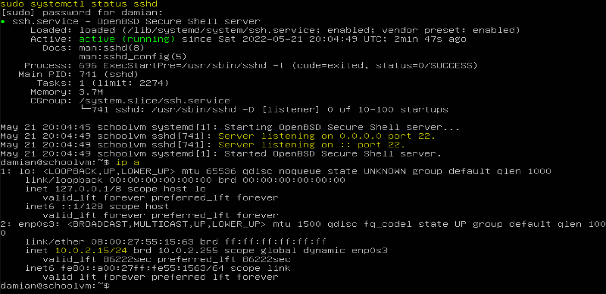
Príkazmi sme zistili že host ma aktívneho deamona SSHD a počúva na porte 22, taktiež sme zistili že Guest OS ma na svojom privátnom Networku IP adresu z rozshahu ktorý sme spomínali vyššie vďaka vstavanému DHCP serveru vo VirtualBoxe.

Naviguje sa prvými dvoma krokmi z posledného obrázka potom si klikneme na tlačidlo Port-Forwarding.

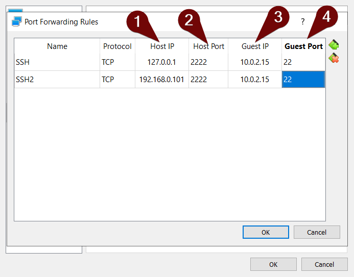

Po otvorený port-forwarding na nás vyskočí tabuĺka kde budeme pridávať pravydlá pre nás virtualny Router. + a x symbolmy môžme pridávať alebo odoberáť pravidlá.
1. Ako prvú nastavíme Host IP, to je IP adresa našeho fyzického PC cez ktprý sa budeme pripájať
2. Host port na našom fyzickom PC je port cez ktorý s budeme pripajať na SSH port na Guest OS
3. Guest IP je ip adresa virtualneho PC na inej siety na ktorý sa budeme pripájať
4. Guest port je port na virtualnom OS na ktorý sa budeme chcieť pripojiť

Pre pripojenie na vzdialený OS na idej siety možeme použiť ak Loopback adresu kedze táto požiadavka ide na Router ktorý keď uvidí že specifikujeme port 2222 tak nepresmeruje požiadvku na náš PC ale na PC inej sieťe s iným portom podľa toho ktoý port sme v tabuľke specifikovali.

Potom čo sme dokončili nastavenie port-forwarding možeme vyskúsať pripojenie na Guest OS cez SSH. Podobne ako predtým (pripojenie cez NAT) sa pripojíme cez CMD

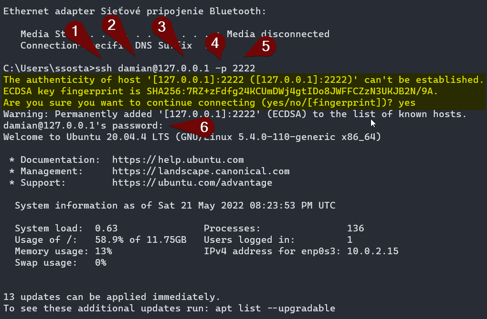

1. špecifikujeme aký prikaz chcemem
2. Na akého používateľa sa chcemem pripojiť
3. Na akú IP adresu sa chceme pripojiť (V našom prípade to može byt Loopback alebo adresa na našom privátom networku)
4. argumentom -p špecifikujeme že chceme pre pipojenie použíť iný než defaultny port
5. Tu specifikuje aký iný port chceme použiť
6. Po úspešnej autentifikácii už len zadáme heslo pre prihlásenie

Žlto zvýraznená čast hovorí o tom že SSH na našom host PC ešte nemá uložený klúč k takejto predošlej komunikácii a to že nevie tento Guest overiť, zobrazí nam jeho fingertprint (identifikacný kód podľa ktorého vieme Guest OS presne určit), a opýta sa nás či chceme pokračovat --> jednoducho zadáme `yes`, taktiež si tento fingerprint uloží pre dalšiu komunikáciu.

Takto sme sa úspešne prihlasili cez SSH na PC vo vzdialenej sieti.

---

## Placeholder dalsej praktickej casti
TODO: dorobiť ešte jeden z tých adaptérov prakticky, skúsiť nejaké iné nastavenie tej siete host only alebo niečo iné co si vyberiem, tak ako pri NAT to popsať a vyskúšať

---
## Trobleshooting

```Bash
sudo apt install net-tools openssh-server
```
Pre naistalovanie dodatocných sietových príkazov a SSHD

```Bash
sudo systemctl restart sshd
```
Reštartuje SSH deamona ak by nefungoval správne

```Bash
sudo systemctl stop sshd
```
Pozastavý deamona na čas co najbližsieho reštaru

```Bash
sudo systemctl disable sshd
```
Uplne vypne SSH deamona aj pri štarte

```Bash
sudo kill -x
```
Zastavý proces s daným PID

```Bash
sudo htop
```
Terminálový program kde si môžem pozrieť procesy na OS

```Bash
cat /var/log/auth.log
```
Výpis logov SSH

```CMD
netstat -ano | findstr :2222
```
Zistíme či niečo poćúva na host OS na danom porte

```Bash
netstat -pevanut | grep :22 
```
Či niečo počuva na Guest OS na danom porte
## Zdroje

https://www.nakivo.com/blog/virtualbox-network-setting-guide/
https://www.virtualbox.org/manual/ch06.html#network_nat_service
<!-- Obsah vygenerovať neskor
ak mas extension tak CTRL+SHIFT+P a napisat create table of content
-->
